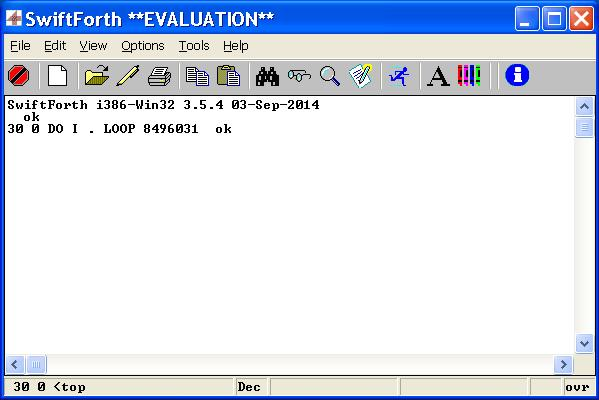

TclForth itself is a model of an application system.

Add your source files to the source directory and adapt the load file load.tcl

For distribution store the full source in [starpacks](http:// wiki.tcl.tk/3663). 

roses are red 
Violets are blue

#### Source Files ###

Usually a starpack contains every part of the application including the source files. In TclForth the source files are handled externally, as they also serve as system documentation. And let you modify the TclForth system without the hassle of unpacking and repacking the Starpack. Simply restart TclForth.

 File         | Description 
 :----------- | :----
 compiler.tcl | Converts Forth definitions to Tcl procedures 
 forth.fth    | Defines the standard Forth words 
 tk.fth       | A Forth interface to Tk 
 console.fth  | The Forth console 
 tfload.tcl   | The load file for TclForth 
 chess.fth    | A TclForth example application 

#### Ein Bild ###

[image](image.png)

> hallo noch ne zeile

> oder eine lange epistel eingeschoben

> gültig bis eine Zeile ohne > beginnt

dann `geht es normal` weiter

